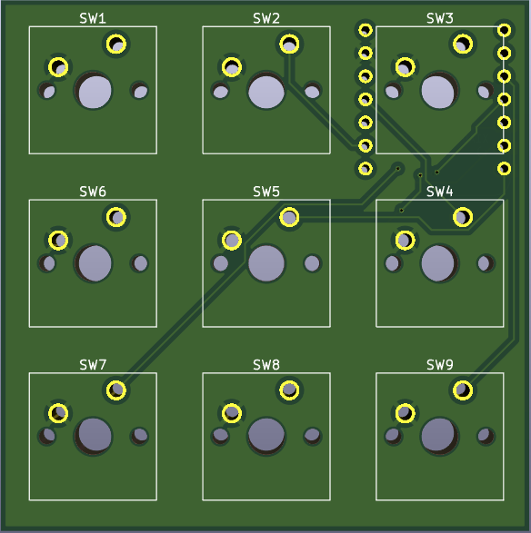
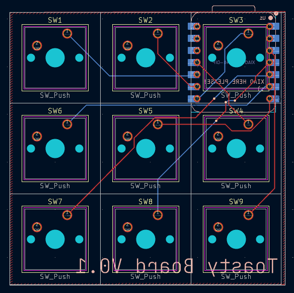
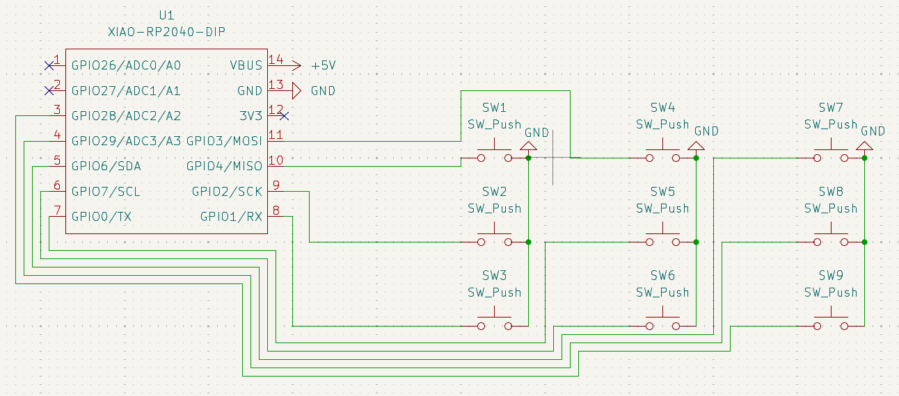
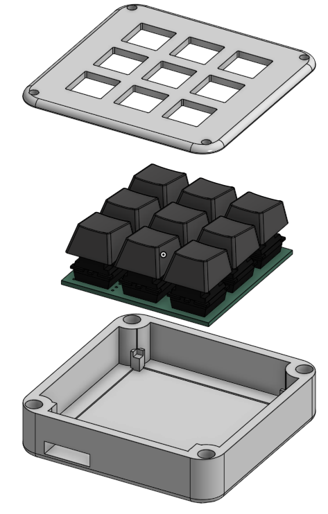

# Toasty Pad

## Features

- 3×3 grid
- 9 keys
- Minimalist design
- Keys can be programmed with macros using QMK

## PCB

I made my PCB using KiCad.

/\ PCB uses a ground plane so it looks like the gnd pins are not connected but they are :)

> This probably breaks many schematic/layout rules, but it looks like it will work.

## CAD

Printed in two pieces; looks pretty good. Made in Onshape.

## Firmware

This project uses QMK firmware included in this repository.
